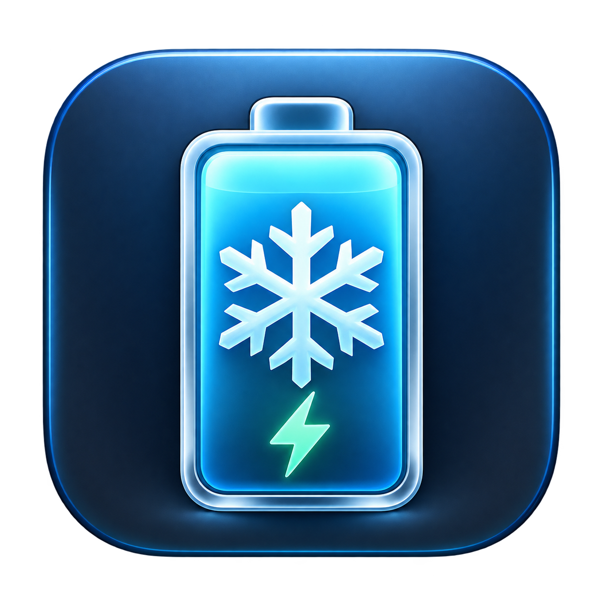

# CoolCharge

<p align="center">
  
</p>

CoolCharge is a native macOS menu-bar controller for Apple-silicon MacBooks. It adds temperature-aware charging, configurable charge targets, live battery information, and a manual adapter-only hold without intentionally discharging the battery.

> [!IMPORTANT]
> CoolCharge is an independent utility, not an Apple product. It relies on the open-source `batt` daemon for privileged charge control. Apple firmware safety systems remain active.

## Features

- Live charge percentage, temperature, cycle count, power flow, voltage, current, capacity, and health.
- Compact menu-bar status that communicates charging, cooling hold, adapter-only hold, and override states.
- Adjustable normal charge target.
- Thermal pause and resume hysteresis to avoid rapid charge switching.
- Manual **Use Adapter Only at Current Level** hold at any charge percentage.
- **Charge Now** and **Top Up** overrides for times when charge is more urgent than the custom temperature rule.
- Native SwiftUI interface with no background account, analytics, or cloud service.

## Behaviour

- Normal charge target defaults to 80%.
- At the configured battery temperature, charging pauses at the current percentage while the adapter remains available to power the Mac.
- Charging pauses at the configured temperature and resumes 2°C lower, only after the hold has lasted at least five minutes and two consecutive cool readings have confirmed the temperature.
- The custom temperature rule applies at every battery percentage; use **Charge Now** or **Top Up** when charge is more urgent than the custom thermal preference.
- **Use Adapter Only at Current Level** creates a manual hold at any percentage.
- **Charge Now** temporarily ignores the custom temperature threshold until the normal target is reached.
- **Top Up** temporarily ignores the threshold until 100% is reached.
- Finishing or cancelling an override always restores the normal charge target, even when the battery is already above it.
- Apple firmware thermal protection is never disabled.

## Charging backend and setup

CoolCharge reads temperature itself, but it intentionally delegates privileged charging control to the free, open-source [`batt`](https://github.com/charlie0129/batt) daemon. It never runs downloaded shell scripts or requests an administrator password itself.

Install and start the Homebrew `batt` service. Its service definition grants non-root client access so the menu-bar app can request charge limits:

```sh
brew install batt
sudo brew services start batt
```

Do not install `batt` using multiple methods at the same time. Disable macOS **Optimized Battery Charging** and the built-in **Charge Limit** while using CoolCharge; otherwise the controllers can conflict.

Until `batt` is installed, CoolCharge operates as a read-only battery-temperature monitor and its charging buttons remain disabled.

## Requirements

- An Apple-silicon MacBook.
- macOS 13 or newer.
- The `batt` daemon for charge-control features.
- Xcode with command-line tools to build the app and compile its asset catalog.

## Install from the DMG

1. Download `CoolCharge-0.1.0.dmg` from the [latest GitHub release](https://github.com/saitrogen/CoolCharge/releases/latest).
2. Open the DMG and drag **CoolCharge** onto the **Applications** shortcut.
3. Start the `batt` service as described above, then open CoolCharge.

The current community build is ad-hoc signed because it does not yet have an Apple Developer ID certificate or notarization. On first launch, macOS may require you to Control-click the app and choose **Open**, or approve it under **System Settings → Privacy & Security**. The SHA-256 checksum is included with every release.

## Build from source

```sh
git clone https://github.com/saitrogen/CoolCharge.git
cd CoolCharge
zsh Scripts/build-app.sh
```

The locally signed application is created at `CoolCharge.app`. You can launch it directly or copy it to `/Applications`.

Create a compressed drag-to-Applications DMG with:

```sh
zsh Scripts/package-dmg.sh
```

The DMG and its SHA-256 checksum are written to `dist/`.

Run the policy tests with:

```sh
swift test --disable-sandbox
```

## Safety and firmware note

On newer `20xxx` firmware, Apple firmware owns the charge-limit decision. When the battery is above a configured limit, firmware may briefly use the battery until it returns to the configured range. CoolCharge therefore holds at the current rounded percentage and does not use `batt adapter disable`, which would deliberately disconnect wall power and discharge the battery.

CoolCharge reduces avoidable heat exposure; it cannot guarantee battery health or prevent normal ageing. Always keep macOS and firmware protections enabled.

## License

CoolCharge is available under the [MIT License](LICENSE). `batt` is a separate project with its own license and release process.
